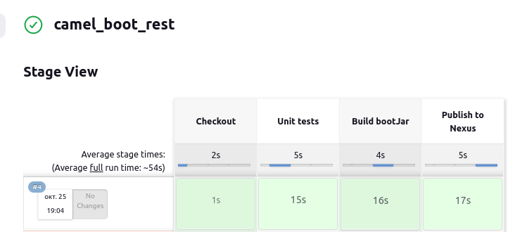

### Простой проект с Java, Camel, Rest, Spring boot

run app:

````shell
./mvnw spring-boot:run
````

run tests:

````shell
http :9090/hello-world

"Welcome to java techie"

http http://127.0.0.1:9090/getOrders
[
    {
        "id": 67,
        "name": "Mobile",
        "price": 5000.0
    },
....
]
````

http POST :9090/addOrder < ~/temp/order.json


# spring-camel-rest-dsl
How to expose Rest API using Spring Boot with Apache Camel

## Dependencies we have to add for apache camel

<dependency>
    <groupId>org.apache.camel</groupId>
    <artifactId>camel-spring-boot-starter</artifactId>
    <version>2.24.0</version>
</dependency>
<dependency>
    <groupId>org.apache.camel</groupId>
    <artifactId>camel-servlet-starter</artifactId>
    <version>2.24.0</version>
</dependency>
<dependency>
    <groupId>org.apache.camel</groupId>
    <artifactId>camel-jackson</artifactId>
    <version>2.24.0</version>
</dependency>

##  Rest APIs
[https://github.com/cherepakhin/camel_boot_rest/blob/main/src/main/java/ru/perm/v/spring/camel/api/resource/ApplicationResource.java](https://github.com/cherepakhin/camel_boot_rest/blob/main/src/main/java/ru/perm/v/spring/camel/api/resource/ApplicationResource.java)

````java
@Component
public class ApplicationResource extends RouteBuilder {


    @BeanInject
    private OrderService orderService;

    @BeanInject
    private OrderProcessor processor;

    @Override
    public void configure() throws Exception {
        restConfiguration().component("servlet").port(9090).host("localhost")
                .bindingMode(RestBindingMode.json);

        rest().get("/hello-world").produces(MediaType.APPLICATION_JSON_VALUE)
                .route()
                .setBody(constant("Hello world")).log("Get /hello-world").endRest();

        rest().get("/getOrders").produces(MediaType.APPLICATION_JSON_VALUE)
                .route()
                .setBody(() -> orderService.getOrders())
                .log("Get /getOrders")
                .endRest();

        rest().get("/getOrder/{id}")
                .produces(MediaType.APPLICATION_JSON_VALUE)
                .outType(Order.class)
                .route()
                .log("Header ${header.id}")
                .to("bean:orderServiceImpl?method=getOrderById(${header.id})")
                .endRest();

        rest().post("/addOrder")
                .consumes(MediaType.APPLICATION_JSON_VALUE)
                .type(Order.class)
                .outType(Order.class)
                .route()
                .process(processor)
                .log("Post /addOrder")
                .endRest();
    }

}

````

### Сборка fat файла

````shell
./mvnw package
````

Собранный файл будет в target/camel_boot_rest-0.0.1.jar

Запуск:

````shell
java -jar camel_boot_rest-0.0.1.jar
````

Смена основного порта __9090__ (задан в application.properties) на __8960__:

````shell
export SPRING_APPLICATION_JSON='{"server":{"port":8960}}'
java -jar camel_boot_rest-0.0.1.jar
````

Проверка:

````shell
$ http :8960/hello-world

"Hello world"

````

### Сборка в Jenkins



### Интеграционные тесты с RestAssured

[https://github.com/cherepakhin/camel_boot_rest_restassured_test](https://github.com/cherepakhin/camel_boot_rest_restassured_test)